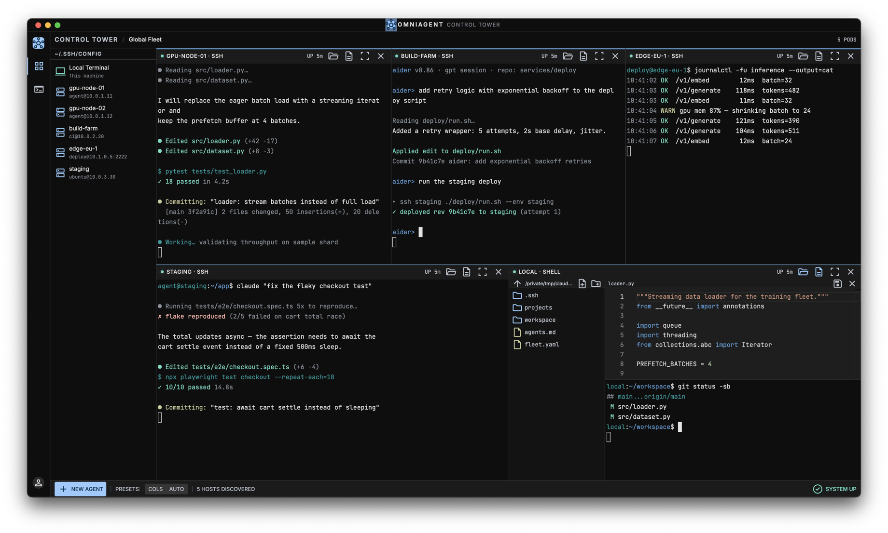

# OmniAgent

**A control tower for your AI agent fleet.**



OmniAgent is a native desktop terminal built for one job: running and monitoring
CLI coding agents (Claude Code, aider, Codex CLI, …) across all of your machines
at once. Every server becomes a *pod* in a tiled grid — each pod a live terminal
with its own file explorer and code editor a single click away.

> Terminal is the main. Editor is the modal.

## Why

Existing tools cover halves of this problem:

- **Agent dashboards** (tmux-based TUIs) monitor agents — but only inside one
  machine's tmux.
- **SSH terminal managers** handle many servers — but know nothing about
  long-running agent sessions.

OmniAgent does both: zero-config SSH fleet discovery, persistent agent sessions,
and a control-tower UI designed for watching many agents work in parallel.

### How it compares

| | Terminal grid | SSH manager | Explorer + editor **per terminal** | Sessions restore **with content** | Agent fleet focus |
|---|:-:|:-:|:-:|:-:|:-:|
| iTerm2 / WezTerm / Warp | ✅ | ➖ | ❌ | manual `tmux -CC` | ❌ |
| Tabby / Termius | ✅ | ✅ | basic SFTP, separate view | ❌ | ❌ |
| MobaXterm *(Windows)* | tabs | ✅ | ✅ | ❌ | ❌ |
| VS Code Remote-SSH | ➖ | one host at a time | ✅ | ❌ | ❌ |
| tmux dashboards (TmuxCC, …) | TUI | ❌ | ❌ | ✅ | ✅ local only |
| **OmniAgent** | ✅ | ✅ zero-config | ✅ docked in every pod | ✅ by default | ✅ across servers |

The last column is where OmniAgent is headed: agent status detection,
needs-input notifications, and fleet-wide agent instructions are the
[current milestone](https://github.com/sbyoun/OmniAgent/milestones).

## Features

- **Zero-config fleet** — your `~/.ssh/config` *is* the server list. No accounts,
  no database, no setup UI.
- **Pod grid multiplexing** — every connection is a pod in a draggable,
  resizable grid (powered by Dockview). Presets: `2×2`, `3-COL`, `FOCUS`.
- **Full session restore** — close the app, reopen it, and every pod comes back:
  same hosts, same layout, same terminal content. Local pods run in per-pod tmux
  sessions; remote pods attach to tmux on the server.
- **On-demand explorer & editor** — toggle a file tree or a Monaco editor inside
  any pod. Remote file access uses one-shot `ssh` commands (your existing keys),
  connected only while you use it. `⌘S` saves straight back to the server.
- **Session lifecycle that makes sense** — `exit` ends the session and closes
  the pod; closing a pod kills its backing session; quitting the app preserves
  everything for next launch.
- **Native & lightweight** — Tauri 2 (Rust backend), not Electron.

## Stack

| Layer | Tech |
|---|---|
| Shell | Tauri 2 (Rust) |
| PTY | portable-pty + tmux |
| UI | React 19 + TypeScript + Tailwind CSS 4 |
| Layout | dockview-react |
| Terminal | @xterm/xterm |
| Editor | Monaco |

## Getting started

Requirements: [Rust](https://rustup.rs), Node.js 18+, and `tmux`
(optional, needed for local session restore; `brew install tmux`).

```bash
git clone https://github.com/sbyoun/OmniAgent.git
cd OmniAgent
npm install
npm run tauri dev    # development
npm run tauri build  # production bundle
```

On first launch the sidebar lists every concrete `Host` from your
`~/.ssh/config`. Click one (or *Local Terminal*) to launch a pod.

## Status & roadmap

Early but functional — built and daily-driven on macOS. Windows/Linux are
untested.

Development is tracked on the [issue tracker](https://github.com/sbyoun/OmniAgent/issues)
and grouped into [milestones](https://github.com/sbyoun/OmniAgent/milestones):

- **v0.2.0 — Control Tower Core**: [`FLEET.md` unified agent instructions](https://github.com/sbyoun/OmniAgent/issues/1),
  [agent status detection](https://github.com/sbyoun/OmniAgent/issues/2),
  [needs-input notifications](https://github.com/sbyoun/OmniAgent/issues/3)
- **v0.3.0 — Fleet Operations**: [broadcast dispatch](https://github.com/sbyoun/OmniAgent/issues/4),
  [fleet journal](https://github.com/sbyoun/OmniAgent/issues/5),
  [remote named sessions](https://github.com/sbyoun/OmniAgent/issues/6)

Issues and PRs welcome.

## License

[MIT](LICENSE)
